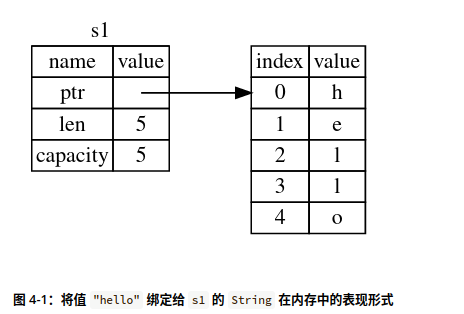
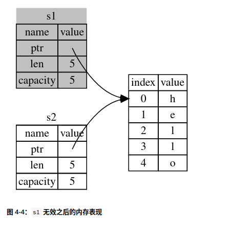
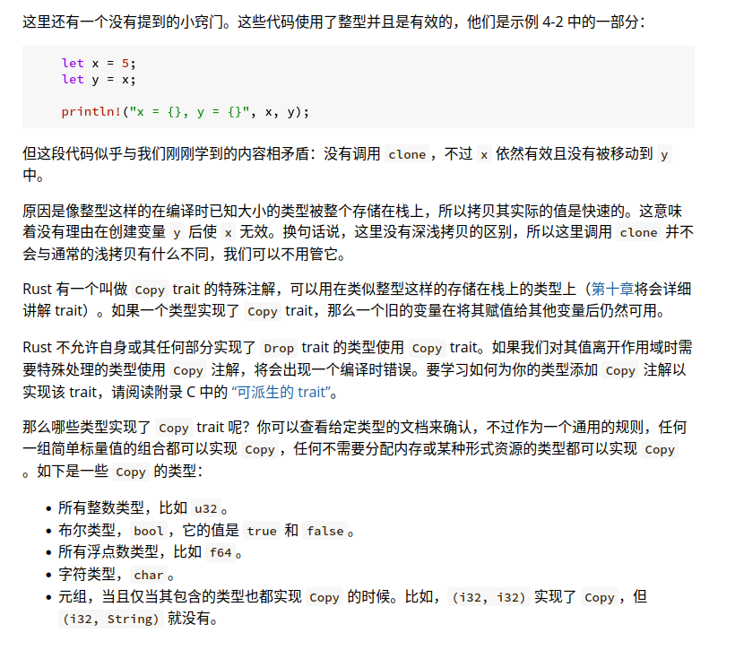
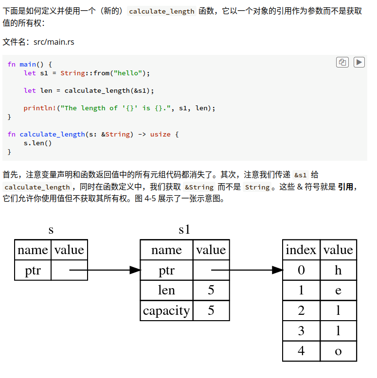
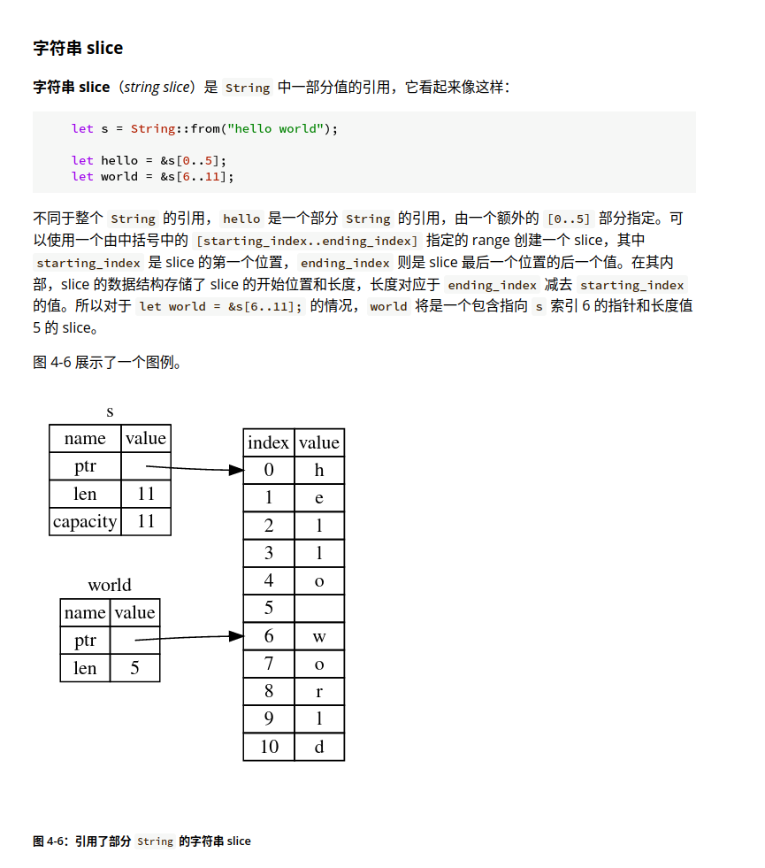
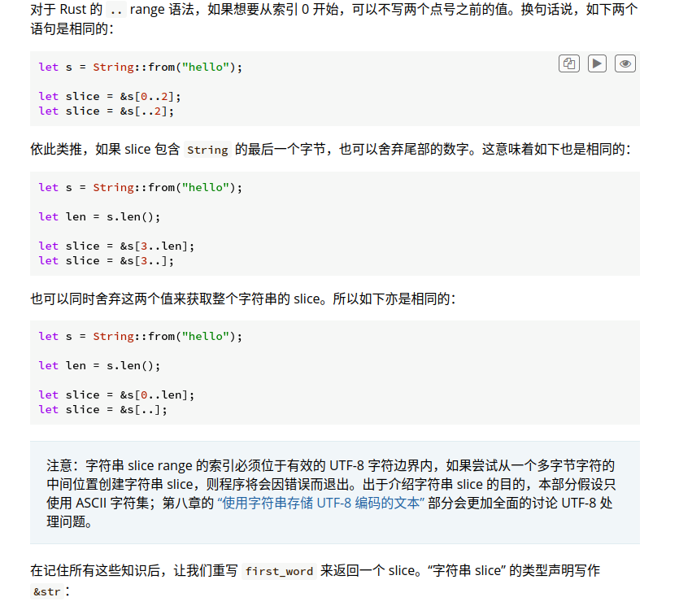
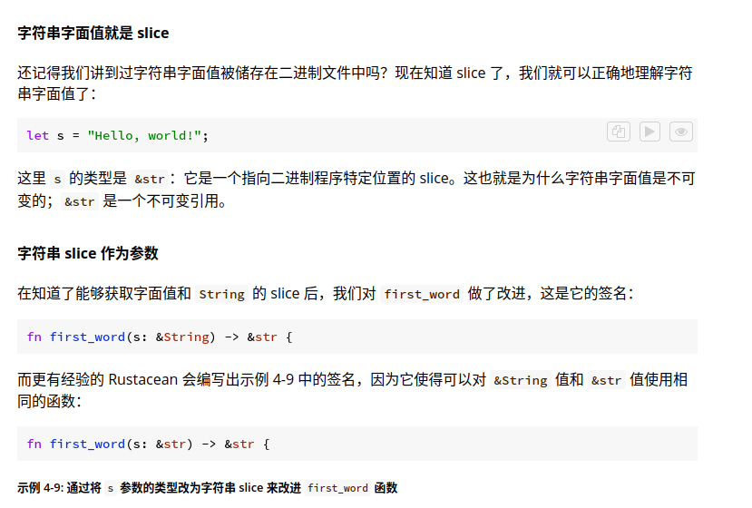
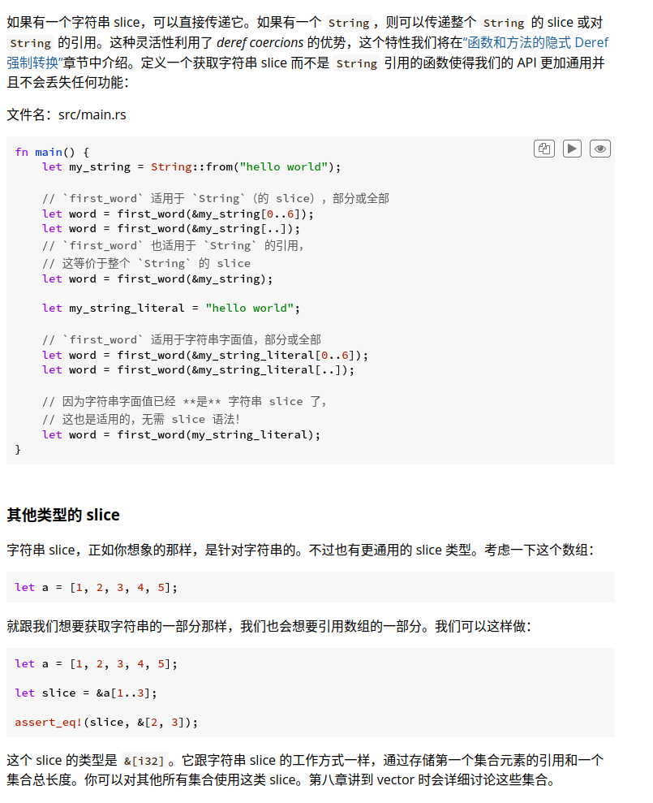

# Ownership
1. Rust 中的每一个值都有一个 所有者（owner）。

2. 值在任一时刻有且只有一个所有者。

3. 当所有者（变量）离开作用域，这个值将被丢弃。


# String

string里的数据是分配在堆上的。

而基础数据类型都是分配在栈上的（因为大小已知）

而string的长度显然是由用户决定的。

假如我们有以下代码：

```rust
    let s1 = String::from("hello");
    let s2 = s1;
```

在执行完let s2=s1之后，s1便不再有效

String的底层如图所示



上述的代码底层如图



这个操作被称为**移动**(move)

符合ownership的第二条

> 2. 值在任一时刻有且只有一个所有者。

# 克隆

如果真的需要深度复制的话可以使用clone()函数

```rust
let s1 = String::from("hello");
let s2 = s1.clone();
```

# 关于栈上的元素



# 引用

rust函数传参数时，会讲实参赋值给形参，这会导致所有权的移动，如果我们只是想传递值而不是传递所有权，我们可以使用引用(reference)



&s1表示一个指向值s1的引用

## 可变引用

可以有多个不可变引用

但是可变引用只能有一个

并且可变引用和不可变引用不能共存

# Slice

slice 允许你引用集合中一段连续的元素序列，而不用引用整个集合。slice 是一类引用，所以它没有所有权。





**字符串slice的类型为&str**



