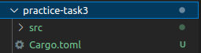
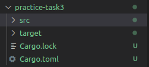
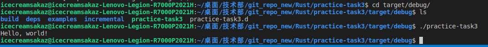
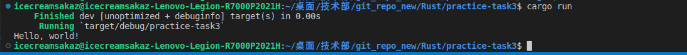
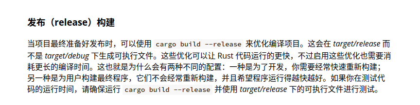

# 构建项目

使用cargo new 项目名称

例如

```
cargo new parctice-task3
```

生成如下目录



一般来说

src文件夹是用来放置代码的地方

Cargo.toml是用来构建项目的，类似于CMakeLists.txt

使用cargo build可以构建程序要在项目目录下，比如这里就要在practice3-task3的目录下执行该条命令



可以看到多了Cargo.lock和target文件夹

Cargo.lock文件不用管，让Cargo自己去处理

由于cargo build命令默认是debug build

所以产生的可执行文件在/target/debug下



当然这一步也可以用cargo run来代替



cargo check可以用来检查编译通过，但不产生可执行文件。

