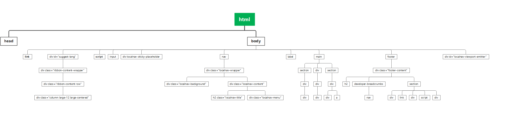
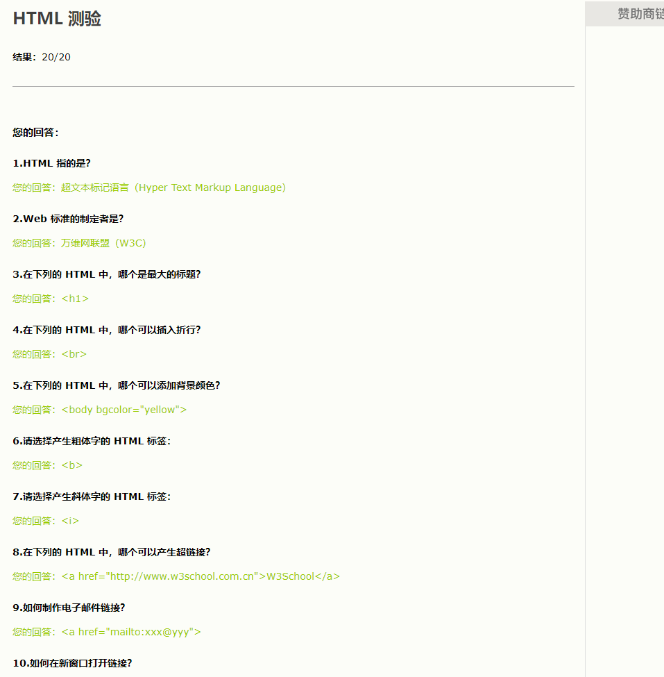

# 1

F12的工具便于我们去寻找网页中的元素

# 2

## Q1

## Q2

HTML和XHTML都是基于SGML（标准通用标记语言）的衍生物，而XML是一种独立的标记语言。

HTML具有较宽松的语法规则，允许一些不完全正确的标记。而XHTML是更严格的版本，要求标记必须符合XML的规范，要求标签闭合、大小写敏感等。

HTML主要用于构建Web页面，定义页面结构和呈现内容。XML用于存储和传输数据，适用于各种领域的数据交换和存储。XHTML是HTML和XML的结合，旨在将HTML转变为符合XML规范的格式。

## Q3

成绩截图:

# 3 

见practice task7 下的文件